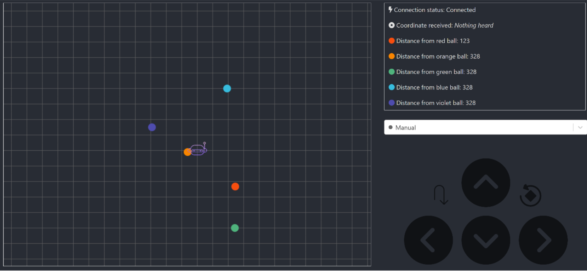

# Mars Rover Project

A web-application consisting of a NodeJS backend and React frontend to allow for remote control of a semi-autonomous rover. It also allows the user to track the rover's movements in a fixed field, and maps the positions of detected objects around the rover.

## Data flow from other components

Uses the MQTT publish/subscribe model where data is published to specific topics which interested parties can subscribe to. This is used to track the coordinates of the rover, which need to be constantly upated. Information on detected objects will also be transmitted over MQTT over a different topic and stored in a MongoDB database.

## Backend

Developed using ExpressJS to handle HTTP requests and NodeJS to query a MongoDB database. The Express API was hosted on Heroku but is no longer running.

## Frontend

Developed using ReactJS. Contains a WASD-type user control for the rover, as well as buttons for 180° and 360° turns (useful for scanning the field for objects due to camera's fixed position). There is also a dropdown menu for the user to automatically navigate towards detected objects. Information on connection status as well as object distances is also transmitted and displayed.

The frontend is hosted [here](https://laughing-kare-b5e7a5.netlify.app/), and can be seen below:

